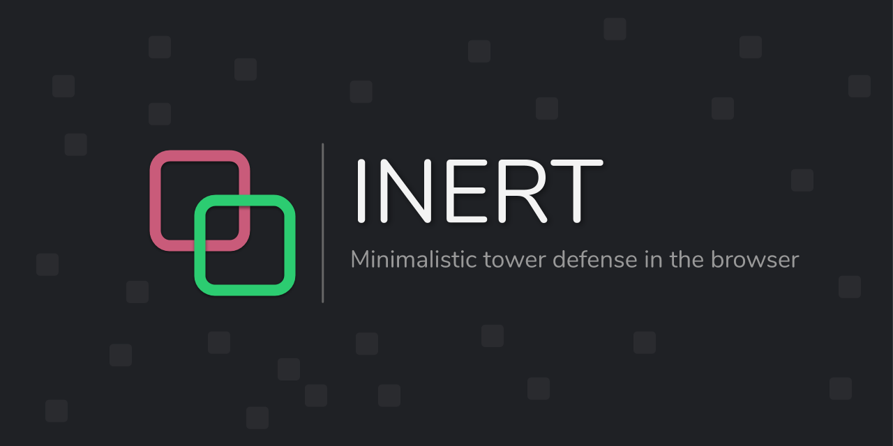

# 🛡️ 提示词塔防 · Prompt Defense

### 用一场塔防游戏，学会如何与 AI 沟通。

<p align="center">
  <a href="https://prompt-defense.crowntime.cn/">
    
  </a>
  
  
</p>

<p align="center">
  
</p>

---

## 为什么做「提示词塔防」？

> **扫雷教会了人们怎么用鼠标。**<br>
> **单词过河教会了人们怎么用键盘。**<br>
> **提示词塔防想要教会人们怎么写提示词。**

AI 正在成为一种新的计算机交互方式。

过去，我们通过鼠标点击按钮，通过键盘输入命令。

现在，我们开始直接用自然语言告诉计算机：

**我想要什么。**

但真正有效地使用 AI，并不只是“会打字”。

你需要学会表达目标、设定约束、说明优先级、处理例外，并根据结果不断修正自己的指令。

这就是 **Prompt（提示词）**。

提示词塔防试图把这件原本抽象的事情，变成一场可以直接看到结果的游戏。

**你写下一句话，AI 就会按照它去打一场仗。**

说得清不清楚，战场会告诉你。

---

## 🚀 在线试玩

👉 **[https://prompt-defense.crowntime.cn/](https://prompt-defense.crowntime.cn/)**

不需要安装。

进入游戏，写下你的第一条 Prompt，然后看看 AI 能守到第几波。

---

## 🎮 你不控制塔，你控制 AI

普通塔防里，玩家直接决定：

- 在哪里建塔
- 建什么塔
- 什么时候升级
- 钱应该怎么花

在「提示词塔防」里，这些事情都交给 AI。

你唯一真正拥有的武器，是 **Prompt**。

你可以告诉 AI：

```text
优先在道路拐角建立减速塔。

至少保留 30% 的资金作为应急储备。

如果出现高生命值敌人，
优先升级单体高伤害炮塔。

如果敌人进入核心 3 格范围，
放弃储蓄，立即使用所有资源防守。
```

AI 会读取你的战略，根据实时战场状态，自主决定建塔、升级和资源分配。

整个过程形成一条完整的因果链：

```text
你的意图
   ↓
Prompt
   ↓
AI 理解与决策
   ↓
游戏动作
   ↓
战场结果
   ↓
修改 Prompt
   ↓
再次验证
```

---

## 🧠 一局游戏，就是一次 Prompt 实验

提示词塔防真正训练的并不是塔防技巧。

它训练的是人与 AI 协作时最基础的几种能力：

**明确目标**

> “守住基地”很模糊。<br>
> “优先保证不漏怪，其次考虑经济效率”会产生不同的行为。

**设置约束**

> “尽量省钱”和“任何时候至少保留 30% 金币”不是同一种 Prompt。

**建立优先级**

> 当赚钱、输出、减速和保命互相冲突时，AI 应该先做什么？

**描述条件与例外**

> 正常情况下存钱，但敌人进入核心附近时允许打破规则。

**观察结果并迭代**

> Prompt 不需要一次写对。

你可以在同一局游戏里不断修改：

```text
v1.0 → v1.1 → v2.0 → v3.0 ...
```

然后直接观察：

**究竟是哪一句话，改变了 AI 的行为。**

这也是 Prompt Engineering 最重要的学习循环：

```text
表达 → 执行 → 反馈 → 修正
```

---

## ⚔️ 游戏机制

### 玩家：战略指挥官

玩家不直接操作防御塔，而是通过自然语言制定战略：

- 经济策略
- 布阵原则
- 防御优先级
- 塔型选择
- 升级策略
- 紧急情况处理

### AI：战术执行者

AI 可以感知当前战场状态，并调用游戏提供的动作接口：

```text
建塔
升级
选择塔型
选择位置
管理经济
调整防守策略
```

AI 负责执行。

**人类负责表达意图。**

---

## ♾️ 局内 Prompt 进化

每一枚硬币代表一次挑战机会。

敌人的波次不断增强，而你的 Prompt 也可以不断进化。

你不需要在开局就写出一个“完美 Prompt”。

真正的玩法是：

```text
发现问题
↓
修改 Prompt
↓
观察 AI 行为
↓
发现新的问题
↓
继续修改
```

最终，比拼的不只是“谁活得更久”。

也是：

**谁能更准确地让 AI 理解自己的战略。**

---

## ✨ 技术实现

### 🧠 LLM 战术 Agent

当前版本由 **DeepSeek** 驱动。

LLM 负责把自然语言战略转换为结构化战术决策，例如：

```text
建塔坐标
塔型选择
升级目标
经济储备
威胁优先级
```

### ⚙️ Engine / Agent 分层

游戏引擎与 AI Agent 相互独立。

确定性游戏引擎负责：

```text
帧循环
伤害计算
敌人移动
A* 寻路
资源结算
胜负判断
```

LLM 不直接修改游戏状态。

AI 只能通过受约束的游戏动作接口与世界交互，从而减少幻觉和越权行为对游戏规则的影响。

### 🕹️ 极简战术终端

界面设计延续了上游项目 [inert](https://github.com/CorentinTh/inert) 的极简塔防风格，让注意力尽量集中在：

**Prompt → AI 行为 → 战场反馈**

这条核心链路上。

### 🏆 Leaderboard

游戏记录玩家的最佳波次与战绩。

随着 Prompt 不断演化，一套属于玩家自己的 AI 战术策略也会逐渐形成。

---

## 💡 一个 Prompt 示例

如果不知道第一句话该怎么写，可以从这里开始：

```text
你的最高目标是保证核心不被敌人突破。

经济策略：
始终保留至少 30% 的资金作为应急储备。

阵型策略：
优先在敌人行进路线的拐角部署减速塔，
并在减速区域后方建立主要输出火力。

升级策略：
当出现高生命值敌人时，
优先升级单体高伤害炮塔。

紧急规则：
如果敌人进入核心 3 格以内，
立即取消资金储备限制，
使用所有可用资源进行防守。
```

然后开始游戏。

你很可能会发现：

**AI 并不会完全按照你脑子里想象的方式行动。**

这正是游戏真正开始的地方。

---

## 🛠️ 本地运行

### 前置要求

- Node.js 18+ / 20+
- npm

### Clone

```bash
git clone https://github.com/zuohaisu/hackathon921.git
cd hackathon921
npm ci
```

### 启动开发服务器

```bash
npm run dev
```

打开浏览器访问终端提示的地址，通常为：

```text
http://localhost:5173
```

### 检查与测试

```bash
npm run lint
npx tsc --noEmit
npm run test
```

---

## 📜 License & Credits

本项目采用 **GPL-3.0** 开源许可证。

游戏底座与极简塔防引擎 Fork 自：

[CorentinTh/inert](https://github.com/CorentinTh/inert)

感谢原作者 **Corentin Thomasset** 的设计与开源工作。原 LICENSE 与署名均已保留。

### 项目团队

左海粟 · 邓海华 · 崔宏阳 · 张文畅

---

## 最后

我们不知道未来的人会不会把「写 Prompt」叫做一种技能。

就像今天已经没有人会把“会用鼠标”写进简历。

但每一种新的计算机交互方式普及之前，人们都需要先学会如何使用它。

**扫雷让人学会鼠标。**

**单词过河让人学会键盘。**

**提示词塔防，希望让人学会和 AI 说话。**
